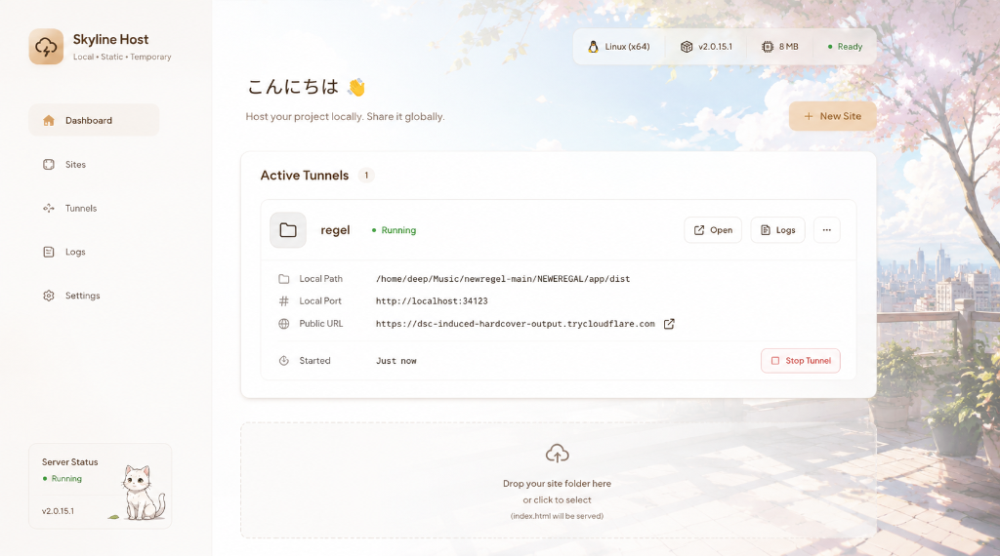

<div align="center">
  
  
  # Skyline Host ✦

  ### Local • Static • Temporary
  
  *Host your project locally. Share it globally.*

  [](#compiled-executables)
  [](https://opensource.org/licenses/MIT)
  [](#android-installation-pwa)
</div>

---

**Skyline Host** is a lightweight, full-stack cross-platform utility that spins up dynamic static file servers on random free local ports for your folders and immediately pipes them into secure, public Cloudflare Tunnels. All controlled via a beautiful warm-editorial **Claude + Anime** fusion dashboard.

<div align="center">
  
</div>

---

## ⚡ Key Features

* 🚀 **Zero-Config Global URL:** Automatically downloads, configures, and spawns a secure Cloudflare Tunnel to generate a public link for any directory.
* 📦 **Dynamic static servers:** Allocates a free port and launches an internal Express server for each directory you declare.
* 📂 **Persistent list:** Saved folders and port allocations are written to `sites.json` and persist across server restarts.
* 💬 **Real-time logs viewer:** View output and connection stats of both the file servers and the tunnel directly inside the terminal log overlays.
* 📱 **Android PWA & Native APK:** Complete layout optimization for mobile web, fully installable as an Android PWA, and build-configured as a native Capacitor APK.
* 🌸 **Aesthetic Anime HUD:** Blurs the beautiful balcony scenery on the left side where the panels sit to keep text highly readable, and gradually unblurs it to the right side where the cherry blossoms are in full bloom.

---

## 📦 Compiled Executables

Grab the standalone, zero-dependency compiler packages directly from our **[Releases v1.0.0](https://github.com/Deep007h/skyline-host/releases/tag/v1.0.0)** page:

| Operating System | Executable Package | Launch Mode |
|:---|:---|:---|
| 🪟 **Windows** | [`Skyline_Host_Windows.exe`](https://github.com/Deep007h/skyline-host/releases/download/v1.0.0/Skyline_Host_Windows.exe) | double-click launch |
| 🐧 **Linux** | [`Skyline_Host_Linux`](https://github.com/Deep007h/skyline-host/releases/download/v1.0.0/Skyline_Host_Linux) | `chmod +x` and double-click |
| 🍏 **macOS** | [`Skyline_Host_macOS`](https://github.com/Deep007h/skyline-host/releases/download/v1.0.0/Skyline_Host_macOS) | standalone binary |
| 🤖 **Android** | [`Skyline_Host.apk`](https://github.com/Deep007h/skyline-host/releases/download/v1.0.0/Skyline_Host.apk) | native Android package installer |

---

## 🛠️ Local Developer Run

If you want to run the project from source code:

1. **Install Node.js & Dependencies:**
   ```bash
   git clone https://github.com/Deep007h/skyline-host.git
   cd skyline-host
   npm install
   ```

2. **Launch the Engine:**
   ```bash
   npm start
   ```

3. **Access the Dashboard:**
   Open your browser to: **[http://localhost:8080](http://localhost:8080)**

---

## 📲 Android Installation (PWA)

To run this dashboard as a standalone app on your Android phone without downloading the APK:
1. Ensure your phone and computer are on the same local Wi-Fi.
2. Open Chrome on your phone and load your computer's local IP address (e.g. `http://192.168.1.71:8080`).
3. Tap the browser menu (three dots) -> click **Add to Home Screen** (or **Install App**).
4. Launches in frameless standalone screen mode, behaving exactly like a native app.
